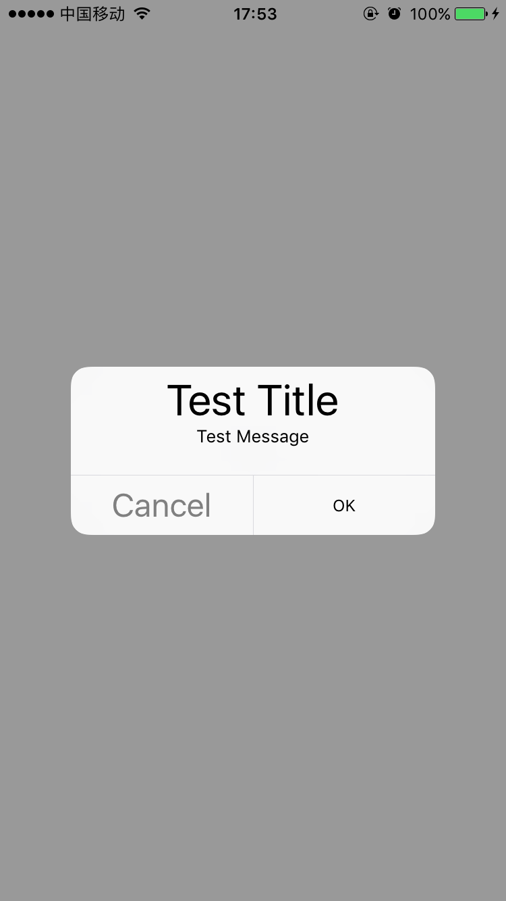

# EFAlertController

[](https://travis-ci.org/EyreFree/EFAlertController)
[](http://cocoapods.org/pods/EFAlertController)
[](http://cocoapods.org/pods/EFAlertController)
[](http://cocoapods.org/pods/EFAlertController)

A custom UIAlertController, you can set color and font of title, message and button.

## Overview



## Example

To run the example project, clone the repo, and run `pod install` from the Example directory first.

## Requirements

- iOS 8.0+

## Installation

EFAlertController is available through [CocoaPods](http://cocoapods.org). To install
it, simply add the following line to your Podfile:

```ruby
pod "EFAlertController", '~> 0.0.1'
```

## Author

EyreFree, eyrefree@eyrefree.org

## License

EFAlertController is available under the MIT license. See the LICENSE file for more info.
